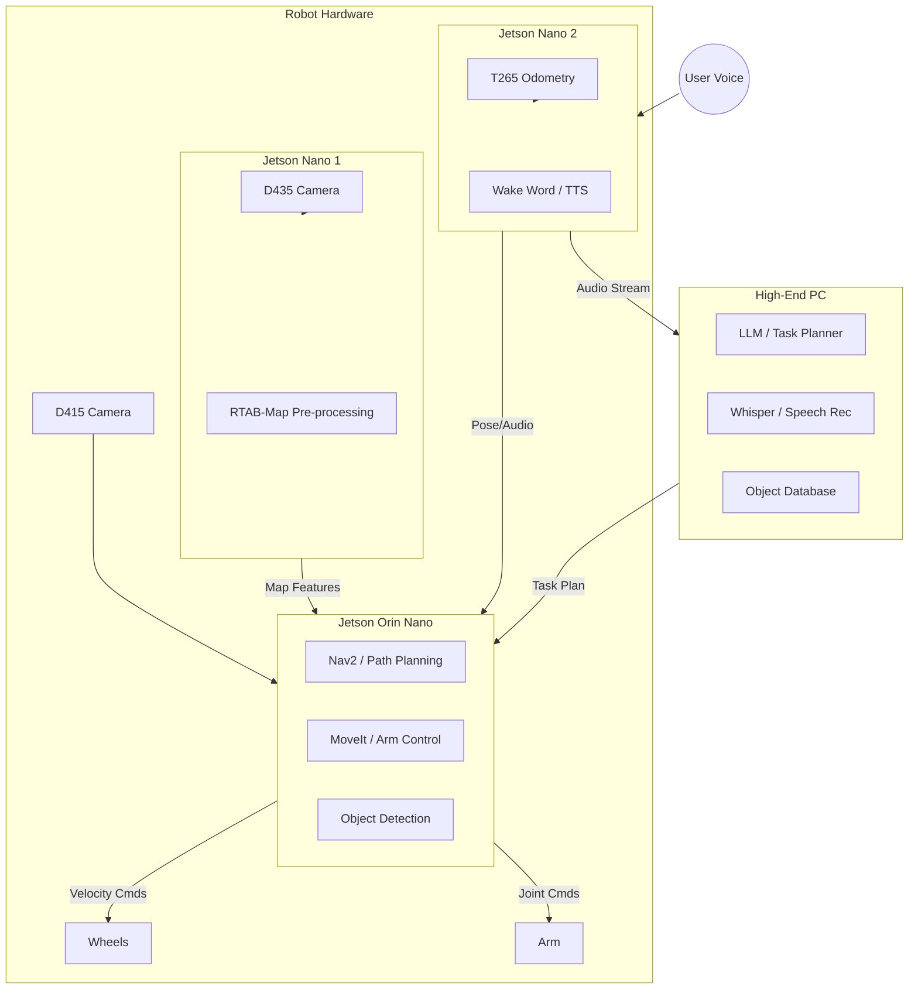

# Optimal Computing Resource Distribution Analysis

## Executive Summary
Based on your available hardware (1x Jetson Orin Nano, 2x Jetson Nano, 1x High-End PC), the optimal architecture is a **Hierarchical Control System**. 

- **Level 1 (Reflexes & Safety):** Jetson Orin Nano (Robot Center)
- **Level 2 (Sensing & Preprocessing):** Jetson Nanos (Peripheral Vision)
- **Level 3 (Cognition & Strategy):** High-End PC (Remote Brain)

This distribution minimizes latency for critical controls while maximizing the AI capabilities of the system.

## Hardware Role Assignment

### 1. Jetson Orin Nano - "The Brain Stem"
**Role:** Central Real-Time Controller & Primary Perception
**Why:** With ~40 TOPS of AI performance (vs 0.5 on Nano), it is the only embedded board capable of running modern neural networks and heavy planning simultaneously.

*   **Critical Responsibilities:**
    *   **Navigation Stack (Nav2):** Path planning and obstacle avoidance.
    *   **Arm Control (MoveIt 2):** Inverse kinematics for the AR4-MK3 arm.
    *   **Primary Object Detection:** Running YOLOv8 (or similar) on images from the D415/D435.
    *   **Safety Controller:** Emergency stops, collision monitoring.
    *   **D415 Processing:** Direct connection to the manipulation camera for lowest latency during grasping.

### 2. Jetson Nano 1 - "The Eyes (Long Range)"
**Role:** Dedicated SLAM & Vision Preprocessor
**Why:** The D435 generates high-bandwidth data. The Nano 1 handles the raw stream, extracting only useful features (compressed SLAM data or map updates) to send to the Orin. This prevents USB bandwidth saturation on the Orin.

*   **Responsibilities:**
    *   **D435 Camera Host:** RGB-D streaming.
    *   **RTAB-Map Preprocessing:** Visual Odometry or RGB-D synchronization.
    *   **Compression:** Turning 100MB/s of raw video into ~2MB/s of map features for the network.

### 3. Jetson Nano 2 - "The Senses (Vestibular & Audio)"
**Role:** Specialized Sensor Hub & Audio
**Why:** This unit is currently underutilized if only used for T265. It should take on additional peripheral tasks to free up the Orin.

*   **Responsibilities:**
    *   **T265 Tracking:** Visual Inertial Odometry (if used).
    *   **Audio Pipeline (Recommended Addition):**
        *   Microphone Array interface.
        *   Wake-word detection (e.g., "Hey James").
        *   Text-to-Speech (TTS) playback.
    *   **System Health Monitor:** Watchdog for the other boards.

### 4. High-End PC - "The Cortex"
**Role:** Large Language Models (LLM) & Complex Reasoning
**Why:** Large models (Llama 3, GPT-4 local equivalents) require VRAM and compute far exceeding embedded devices.

*   **Responsibilities:**
    *   **VLA (Vision-Language-Action):** Processing complex user commands (e.g., "Clean up the mess in the kitchen") into a sequence of robot tasks.
    *   **Knowledge Graph:** Storing persistent "memories" of where objects are.
    *   **Heavy Simulation:** Running a geometric digital twin for advanced motion planning checks before executing on the real robot.
    *   **Voice Understanding:** Whisper (Speech-to-Text) large model for high-accuracy command transcription.

## Architecture Diagram

