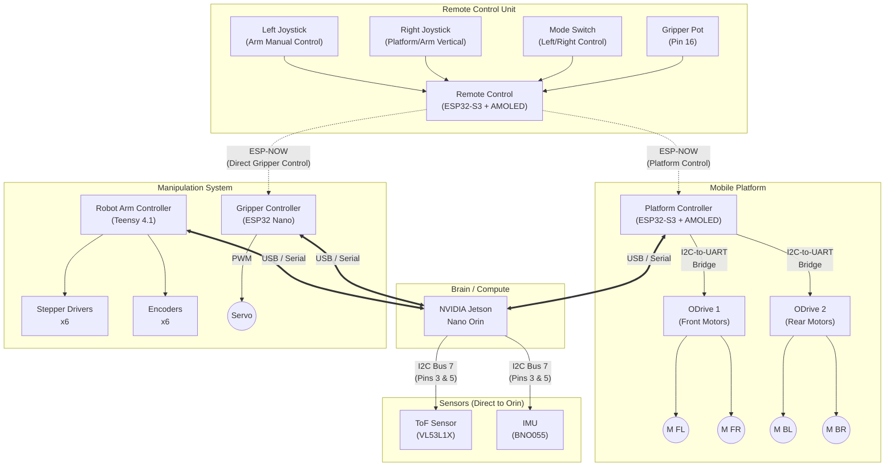

# Hardware Interconnection Diagram

This document outlines the hardware connections between the various components of the James Useful Home Robot, including the Remote Control, Platform Controller, Robot Arm, and Gripper.

## System Overview

The system consists of a central computation unit (NVIDIA Jetson Nano Orin) which communicates with three primary microcontroller subsystems via USB/Serial. The Remote Control communicates wirelessly with the Platform Controller via ESP-NOW.

---

## 2. Component Details & Pinouts

### 2.1 Remote Control Unit (Remote)
**Hardware**: LilyGO T-Display S3 AMOLED V2  
**Role**: Master controller for Mobility (Mecanum) and Manipulation (Arm/Gripper).

#### Control Modes
The **Left Switch** toggles the precision control behavior of the **Right Joystick**.

**Mode A: Platform Control (Switch ON)**
- **Left Joystick**: *Horizontal Arm Control* (Cartesian X/Y). Moves gripper tip Forward/Back/Left/Right while maintaining height and orientation.
- **Right Joystick**: *Platform Movement*. Standard mecanum drive (Holonomic).
- **Gripper Pot**: Servo Open/Close position.

**Mode B: Vertical Arm Control (Switch OFF)**
- **Left Joystick**: *Horizontal Arm Control* (Cartesian X/Y). Same as Mode A.
- **Right Joystick**: *Vertical Arm Control*.
    - Up/Down: Gripper moves vertically (Cartesian Z) maintaining orientation.
    - Left/Right: Gripper Rotation (Yaw) or J1 rotation.
- **Gripper Pot**: Servo Open/Close position.

#### Connections
| Component | Pin (ESP32) | Function | Notes |
| :--- | :--- | :--- | :--- |
| **Right Joystick** | 13 | Analog In | Y-axis (Fwd/Back) |
| | 14 | Analog In | X-axis (Left/Right) |
| | 15 | Analog In | Rotation / Twist |
| **Gripper Pot** | 16 | Analog In | Gripper Open/Close Position |
| **Left Joystick** | *TBD* | Analog In | Y-axis (Arm Fwd/Back) |
| | *TBD* | Analog In | X-axis (Arm Left/Right) |
| | *TBD* | Analog In | Z-axis / Rotation |
| **Mode Switch** | *TBD* | Digital In | Toggle Platform/Arm Vertical Mode |

**Note**: Left Joystick manual control is calculated via Inverse Kinematics on the Orin (received via Platform Controller -> Orin link).

### 2.2 Platform Controller
**Hardware**: LilyGO T-Display S3 AMOLED V2  
**Role**: Controls Mecanum wheels, displays status, bridges remote to Orin.

#### Connections
| Component | Pin (ESP32) | Function | Notes |
| :--- | :--- | :--- | :--- |
| **Orin** | USB | Data | Connected via USB-C port (Serial over USB) |
| **I2C Bridge** | 3 | SDA | To DFRobot I2C-to-Dual-UART Bridge |
| | 2 | SCL | To DFRobot I2C-to-Dual-UART Bridge |
| **Display** | *Internal* | | Landscape orientation |

### 2.3 Robot Arm (AR4 MK3)
**Hardware**: Teensy 4.1  
**Role**: Controls the 6-axis AR4 MK3 robotic arm.  
**Connection to Orin**: USB Serial

### 2.4 Gripper System
**Hardware**: ESP32 (Nano form factor)  
**Role**: Controls end-effector servo only.  
**Connection to Remote**: Direct ESP-NOW link for low-latency gripper actuation.  
**Connection to Orin**: USB Serial (for status/configuration).

#### Connections
| Component | Pin | Protocol | Notes |
| :--- | :--- | :--- | :--- |
| **Servo** | *TBD* | PWM | Gripper Open/Close |
| **Remote** | Wireless | ESP-NOW | Direct control from RC Pin 16 |

### 2.5 Jetson Orin Expansion Header
**Hardware**: NVIDIA Jetson Orin Nano Developer Kit  
**Role**: Central Brain, runs ROS 2, Perception, and Kinematics.

#### Sensor Connections (I2C)
| Component | Bus | Pins | Notes |
| :--- | :--- | :--- | :--- |
| **VL53L1X** | I2C Bus 7 | 3 (SDA), 5 (SCL) | ToF Distance Sensor (Addr: 0x29) |
| **BNO055** | I2C Bus 7 | 3 (SDA), 5 (SCL) | IMU Orientation (Addr: 0x28) |

---

## 3. Communication Flow

### Manual Control Path
1.  **User** manipulates Remote inputs.
2.  **Remote** reads Inputs:
    - **Right Joystick** -> Sent via **ESP-NOW** to **Platform Controller**.
    - **Left Joystick** -> Sent via **ESP-NOW** to **Platform Controller** -> Forwarded via **USB** to **Orin**.
    - **Gripper Pot** -> Sent via **ESP-NOW** directly to **Gripper ESP32**.
3.  **Orin** (running ROS 2):
    - Receives Left Joystick (Cartesian Cmd).
    - Calculates IK for Arm Joint velocities.
    - Sends Joint commands via **USB** to **Teensy**.
4.  **Platform Controller**:
    - If Mode Switch = ON: Maps Right Joystick directly to Mecanum drive (Manual).
    - If Mode Switch = OFF: Ignores Right Joystick (or forwards to Orin for Z-axis control).

### Autonomous Path
- **Orin** has full control over Platform, Arm, and Gripper via USB Serial links.
- **Platform Controller** enforces safety override (Manual input blocks Autonomous platform moves).

