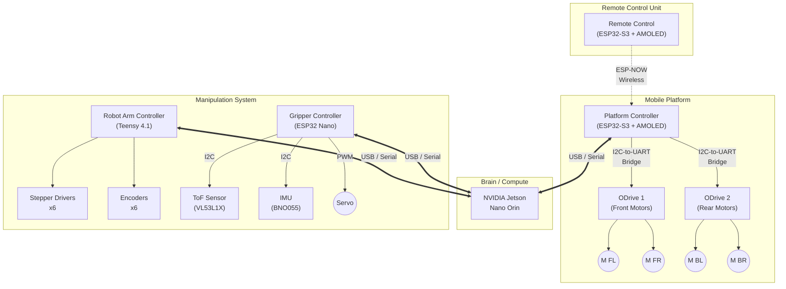

# Hardware Interconnection Diagram

This document outlines the hardware connections between the various components of the James Useful Home Robot, including the Remote Control, Platform Controller, Robot Arm, and Gripper.

## System Overview

The system consists of a central computation unit (NVIDIA Jetson Nano Orin) which communicates with three primary microcontroller subsystems via USB/Serial. The Remote Control communicates wirelessly with the Platform Controller via ESP-NOW.

---

## 2. Component Details & Pinouts

### 2.1 Remote Control Unit (Remote)
**Hardware**: LilyGO T-Display S3 AMOLED V2  
**Role**: Sends manual control commands to the Platform Controller.

> [!WARNING]
> **Pin Conflict Detected**: The source code defines Pin 15 as both `rightJoystickRotationPin` (Input) and `LCD_POWER` (Output). This requires verification on the physical hardware.

#### Connections
| Component | Pin (ESP32) | Function | Notes |
| :--- | :--- | :--- | :--- |
| **Joystick** | 13 | Analog Out | Forward/Backward (Y-axis) |
| | 14 | Analog Out | Left/Right (X-axis) |
| | 15 | Analog Out | Rotation (Z-axis) **(Conflict)** |
| **Display** | 6 | CS | Chip Select |
| | 47 | SCK | SPI Clock |
| | 18 | D0 (MOSI) | SPI Data 0 |
| | 7 | D1 (DC) | SPI Data 1 / DC |
| | 38 | BL | Backlight |
| | 15 | PWR | Display Power **(Conflict)** |

### 2.2 Platform Controller
**Hardware**: LilyGO T-Display S3 AMOLED V2  
**Role**: Controls Mecanum wheels, displays status, bridges remote to Orin.

#### Connections
| Component | Pin (ESP32) | Function | Notes |
| :--- | :--- | :--- | :--- |
| **Orin** | USB | Data | Connected via USB-C port (Serial over USB) |
| **I2C Bridge** | 3 | SDA | To DFRobot I2C-to-Dual-UART Bridge |
| | 2 | SCL | To DFRobot I2C-to-Dual-UART Bridge |
| **Display** | *Same as Remote* | | Landscape orientation |

**Motor Control Chain**:
1.  **ESP32** (I2C) -> **DFRobot Bridge**
2.  **Bridge UART1** -> **ODrive 1** (Front Wheels?) -> Motors FL/FR
3.  **Bridge UART2** -> **ODrive 2** (Rear Wheels?) -> Motors BL/BR

### 2.3 Robot Arm (AR4 MK3)
**Hardware**: Teensy 4.1  
**Role**: Controls the 6-axis AR4 MK3 robotic arm.  
**Connection to Orin**: USB Serial

#### Pinout Configuration (from Firmware)

| Joint | Step Pin | Dir Pin | Encoder A | Encoder B | Cal/Limit Pin |
| :--- | :--- | :--- | :--- | :--- | :--- |
| **J1** | 0 | 1 | 14 | 15 | 26 |
| **J2** | 2 | 3 | 17 | 16 | 27 |
| **J3** | 4 | 5 | 19 | 18 | 28 |
| **J4** | 6 | 7 | 20 | 21 | 29 |
| **J5** | 8 | 9 | 23 | 22 | 30 |
| **J6** | 10 | 11 | 24 | 25 | 31 |
| **J7** (Aux) | 12 | 13 | - | - | 36 |

**Other Pins**:
- **E-Stop**: Pin 39
- **J8/J9 (Aux)**: Defined in code but optional utilization.

### 2.4 Gripper System
**Hardware**: ESP32 (Nano form factor)  
**Role**: Controls end-effector servo and reads environmental sensors.  
**Connection to Orin**: USB Serial

#### Connections
| Component | Pin | Protocol | Notes |
| :--- | :--- | :--- | :--- |
| **VL53L1X** | A4 (SDA) | I2C | Distance/ToF Sensor (Addr: 0x30*) |
| **BNO055** | A4 (SDA) | I2C | IMU / Orientation (Addr: 0x29) |
| | A5 (SCL) | I2C | Shared Bus |
| **Servo** | *TBD* | PWM | Gripper Open/Close |

*\*Note: Firmware changes VL53L1X address from default 0x29 to 0x30 at runtime to avoid conflict with BNO055.*

---

## 3. Communication Flow

### Manual Control Mode
1.  **User** moves Joystick on **Remote**.
2.  **Remote** sends `TransformedValues` via **ESP-NOW** to **Platform Controller**.
3.  **Platform Controller** calculates inverse kinematics for Mecanum drive.
4.  **Platform Controller** sends commands via **I2C** to **UART Bridge**.
5.  **UART Bridge** forwards commands to **ODrive** controllers.

### Autonomous / ROS 2 Mode
1.  **Jetson Orin** runs navigation/manipulation stack.
2.  **Orin** sends velocity commands (`cmd_vel`) via **USB Serial** to **Platform Controller**.
3.  **Orin** sends joint trajectory commands via **USB Serial** to **Teensy (Arm)**.
4.  **Orin** sends gripper commands via **USB Serial** to **Gripper ESP32**.
5.  **Platform Controller** prioritizes Manual input over Autonomous input (safety override).
